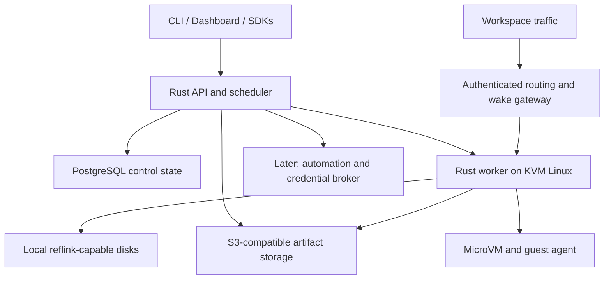

# Proposed architecture

Status: the broader architecture remains a proposal. The local Rust prototype uses
Firecracker and Btrfs under [ADR 0001](adr/0001-local-runtime-and-storage.md).
See [implemented behavior and limitations](LOCAL_PROTOTYPE.md).

## Runtime decision

Default candidate: a Rust product layer around Firecracker. Evaluate Ignition first for useful semantics and potential reuse under an appropriate license. Do not implement a new VMM. Do not assume Firecracker automatically reproduces Ignition's networking or Boxd's live-fork behavior.

| Candidate | Benefit | Required evaluation |
| --- | --- | --- |
| Firecracker | Existing KVM isolation and snapshot primitives; Apache-2.0 | Guest support, snapshot consistency, clone identity, host networking and readiness |
| Ignition | Rust orchestration, KVM, proxying, snapshot-oriented startup | Public tree build, kernel/dependency assumptions, production gaps, AGPL model |
| Container backend | Runs trusted workspaces without nested virtualization | Shared kernel; no promise of full-memory snapshots, live fork, or equivalent isolation |

Backend capability discovery should expose hardware isolation, memory capture, independent disk clone, hibernation, and runtime version. Refuse unsupported operations explicitly.

The current single-machine prototype is one Rust binary with a local Unix-socket
worker, CLI, authenticated browser dashboard/API and loopback gateway. It uses a durable JSON registry and serial guest
command transport rather than the proposed PostgreSQL/API/guest-agent stack below.
That narrow slice validates real VM behavior before adding those services.
The dashboard serves embedded HTML/CSS/JavaScript from Rust and exposes only the
owner's VM lifecycle/exec operations. See [dashboard boundaries](DASHBOARD.md).

## Components



- API: auth, workspace operations, quotas, operation tracking, desired state.
- Scheduler/reconciler: placement, capacity accounting, worker heartbeats, leases, restart recovery. Initially inside the API process.
- Worker: privileged host-facing runtime operations behind an authenticated narrow interface; dedicated data roots and networking.
- Guest agent: command execution, PTY resize/stdin, cancellation, file operations, readiness and lifecycle notifications over a controlled guest/host channel.
- Gateway: endpoint authorization, route-to-worker lookup, wake coalescing, bounded request buffering, HTTP/WebSocket proxying. Raw protocols are a later separate listener/policy.
- CLI: operator login/API keys, create/inspect/exec/files/lifecycle, JSON output and real remote exit status.
- Dashboard and SDKs: use the same versioned API. TypeScript first, Python later. Public REST plus WebSocket streaming is a candidate; gRPC internals are optional. Boxd wire compatibility is not promised.

Rust libraries such as Tokio, Axum, SQLx, tracing, and clap are candidates; choose and pin versions during implementation rather than treating this document as a dependency lockfile.

## Proposed repository layout after the spike

```text
crates/{types,api,worker,guest-agent,cli}/
web/
sdk/{typescript,python}/
deploy/{local,aws,helm}/
docs/{adr,experiments}/
```

Create directories when implementation needs them. This layout is not current code.

## Control model

Objects: Workspace, Worker, Operation, Endpoint, Disk, Snapshot, Checkpoint, Backup, Policy, Principal. Add organizations/connections/jobs only when their phase starts.

Workspace lifecycle: pending -> starting -> running -> paused/hibernated/stopped, plus failed and deleting/deleted. Store desired and observed state separately. Track artifact operations as pending/ready/failed. Validate legal transitions and publish machine-readable errors.

Create and destructive operations need idempotency keys and durable operation IDs. Worker retries and controller restarts must not produce duplicate machines. Reconcile uncertain operations using persistent runtime identity and fencing; do not blindly reschedule a possibly running guest onto another host.

## Storage and state semantics

- Active block disks use local reflink-capable storage where verified. Firecracker block files need an orchestrator-managed independent clone; CoW support is not automatically provided by every host filesystem.
- Freeze/quiesce and capture a paired RAM/disk state. Document crash consistency versus application consistency and hooks for databases.
- Associate captures with runtime version, CPU compatibility, guest image/kernel, disk lineage, policy and identity metadata.
- Encrypt and authenticate artifacts before restore. Snapshot inputs are trusted by the VMM and must not be arbitrary guest-supplied state.
- Preserve parent artifacts while clones reference them. Enforce capacity/retention and safe garbage collection.
- Additional disks require explicit inclusion/exclusion and single-writer attachment leases. Do not allow inconsistent root/RAM restores against a newer external data disk without a documented policy.
- Backups should survive worker loss; local checkpoints alone do not. Test disk restoration on a replacement worker before calling recovery complete.

## Fork and restore correctness

Before exposing a clone, refresh workspace identity, network addresses, guest/host control credentials, entropy, and relevant keys. Notify supported guest processes of restore. Document cached hostname/IP values, clock changes, duplicated side effects, scheduled jobs, expired sessions and reconnect behavior. Preserve disk write independence, not external transactional state.

Do not promise socket continuity across hibernation or migration. Snapshot portability depends on runtime, CPU/kernel/device compatibility; cross-worker recovery may require cold boot from disk when full-state restore is unsupported.

## Security and resource boundaries

- Guest root cannot access host management sockets or relax host network restrictions.
- Block access to host/control networks and cloud metadata endpoints by default; explicitly define DNS, private addresses, IPv6, redirects and domain-policy enforcement.
- Authenticate API and worker traffic; separate human, worker and guest identities. Scope guest management rights narrowly.
- Apply per-workspace CPU, RAM, disk, snapshot, file-transfer and network limits; reserve host headroom and reject excess placement.
- HTTP publishing, shell/desktop access, and organization sharing are distinct permissions. Proposed previews default private unless the owner explicitly publishes them.
- Prefer short-lived brokered credentials. Sharing transitions must consider RAM, logs, backups and snapshots, not only known login paths. Never claim complete credential sanitization from a few deleted files.
- Host-bound secret replacement is deferred pending a TLS/protocol threat model. A dedicated integration broker can deliver value first without generic HTTPS interception.

## Idle and automation

Use explicit running-task leases and configurable idle policies so silent compute jobs are not suspended accidentally. Wake requests need bounded queues and a single in-flight wake per workspace. External schedules/events must wake sleeping guests; guest cron alone cannot do that reliably.

Later automation delivery should define at-least-once semantics, idempotency, retries/backoff, dead-letter handling and tenant isolation. Do not advertise exactly-once external effects.

The current pilot now includes rootless slirp4netns egress with namespace-local nftables source/destination policy and a native HTTPS/WSS remote CLI. See [networking and installer](NETWORKING.md) for the implemented boundary and remaining production work.
