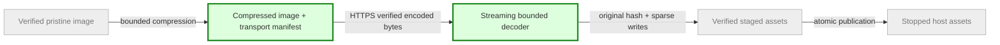

# Compressed Ubuntu delivery — plan brief
Updated: 2026-10-04 | Size: M | State: DONE — reviewed, merged and published | Pattern: ADR0002 gateway + bounded streaming verified host assets

## Goal
Reduce the Ubuntu download using measured compression with quick bounded client decoding. No universal “best/latest” claim: choose a current maintained codec on measured image size, decode time and memory. User already authorized implementation and project publication; no repeated go.

## Data flow

Grey existing; green changed. CLI previously installed must retain existing raw manifest/files until explicitly upgraded.

## Steps
1. Builder measures zstd/xz installed versions against pristine image; choose ratio/decode tradeoff. Benchmark CPU<=2threads, priority lowered, memory<=2GiB, no guests, actual file pinned digest87ba6158…3f3f6b. Compare bounded representative corpus first, full selected image compression/decode/hash once; sample timings single-run, no p50/p95 invention.
2. Implement versioned compressed transport, embedded bounded decoder (one maintained pinned Rust codec dependency allowed), original image digest and sparse decoded writes; keep exact progress and compatible local canonical manifest. Old raw endpoint/bundle remains available; new CLI negotiated distinct compressed manifest endpoint, fallback ONLY404 from older server, reject malformed compressed manifest.
3. Focused executable static TLS acceptance success and corrupt/truncated/oversized encoded/decoded/window/dictionary/trailing/concatenated invalid streams, identity/disk preservation, sparse output, v1/v2 and old server fallback. Actual compressed pristine full decode preserves original hash; no VM rerun needed if byte-identical.
4. Source reviewer clears stable commit/pins; planner merges and publishes immutable new CLI/bundle, exact project-only new manifest/compressed file route allowlist and gateway. Controller/agents/workers/guests unchanged; no cloud API/DNS/Access/globalSSL write. Public pin/headers and preservation checks; retain scoped rollback.

## Scope / gates
Builder: onboarding.rs, necessary gateway routing, bundle/ingress scripts, one codec dependency+lock, focused tests/docs. Fixed names; only Ubuntu compressed initially, no tar extraction, no user disk/snapshot input. Raw delivery persists for old clients; canonical local expanded bytes/hash identical, no migration/re-enrollment. Stop on codec/output/window bounds missing, dependency licensing issue, paid/new services, >2GiB/2CPU benchmark allocation, unrelated code/host policy changes. Unknown1Password inventory remains separate. No service/host/VM/commit outside scoped lane by reviewer; parent owns deployment. Raw plus encoded retained for rollback; disk reserve accounts actual staging/expansion and immutable previous assets.

## Done when
Measured before/after logical bytes, compressed transfer, timings/tool versions and original digest are reported. Stable static portable CLI, complete source/artifact/manifest pins, integrity/failure/legacy tests pass, review cleared, public compressed delivery verified with old raw paths and all owner VMM/worker/agent identities preserved. Compression alone without integrated downloader/publication is incomplete. No incremental caching/resume/other images in this task.
