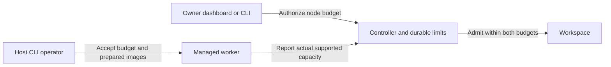

# Adjustable host capacity and Ubuntu — plan brief
Size: M | Pattern: Rust gateway + SQLite owner authority + outbound node agent + private bounded worker (ADR 0002).

## Goal
An existing Linux host can accept owner-authorized budget changes and prepare Ubuntu dev, while users create/resize larger guests within enforced host capacity.

## Flow

Existing control components; budget editing and Ubuntu bundle support are changed. No physical capacity auto-discovery claim.

## Scope and steps
1. Add shared validated bounds (proposed worker ceiling64GiB/64vCPU/8slots, VM ceiling16GiB/16vCPU; keep conservative defaults) throughout runtime, enrollment, capabilities, scheduler, UI and CLI. Make CPU topology available in doctor if feasible without dependencies. Meaningful units for larger shapes and invalid/overflow inputs.
2. Add owner-only durable node budget editing for enrolled IDs (API plus CLI, dashboard if reasonably bounded), and operator `ow host configure` for saved participation. Consent remains local. Require fully stopped owned host before applying changes; do not silently stop/restart guests. Lowering below running/unresolved reservations must fail conservatively. Never create new identities as an edit workaround, bypass owner limits or modify JSON/SQLite externally.
3. Make verified host bundle support clean prepared Ubuntu dev alongside Alpine, with image-specific manifest hashes/paths/advertisement; refresh/update existing host assets via supported CLI without overwriting disks/credentials. Preserve immutable rollback and clean template provenance; use existing owner-independent prepared Ubuntu template, never owner disk/snapshot.
4. Run meaningful focused authority/budget/configuration/manifest regressions and bounded actual4GiB guest acceptance if host headroom permits in dedicated test roots. Tests leave original Ubuntu2048 and physical remote test VM alone. Write report, handoff and exact owner upgrade/configure instructions.
5. Planner reviews stable diff and verification, merges scoped changes and publishes matching reviewed CLI/bundle using dedicated selection. Remote operator applies updates after stopping their test VM by their choice. No remote SSH access exists.

## Blast radius and stop gates
- Product runtime/resource/API/CLI/UI and project artifact selection only; no unrelated services, paid resources, cloud ingress changes, desktop config or cross-host migration.
- Preserve pending main files and existing remote/local guests, disks, snapshots and credentials. No VM deletion, migration or live guest restart.
- Builder stops before any deployment, publishing, old service signaling or remote actions. Planner owns scoped rollout under existing owner authorization; any required stop of a live guest is surfaced before dependent action.
- Ask planner if larger budget semantics require protocol-breaking change or insecure capability expansion. Actual remote chosen RAM/CPU budget awaits owner CPU information; do not auto-allocate based on available RAM.

## Done when
Owner-authority and runtime admission enforce consistent larger limits; an enrolled node can adjust its budget with stopped-host consent and reconnect; new clean Ubuntu is supported on downloaded hosts; stale assets/config and lowering into known/unknown demand fail safely; real4GiB boot/exec/cold persistence evidence or exact blocker reported. No production/physical acceptance claim from unit tests.
