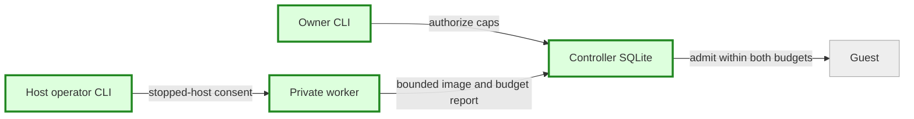

# Host capacity implementation — plan brief
Size: M | Pattern: ADR 0002 gateway + SQLite owner authority + outbound node agent + private worker.

## Goal
Adjust enrolled host limits without re-enrollment; admit larger shapes and verified clean Ubuntu templates on invited Linux hosts.

## Capacity flow (grey existing; green changed)

## Steps
1. Centralize validated ceilings: worker 64 GiB/64 vCPU/8 slots, shapes 256 MiB–16 GiB and 1–16 vCPU; retain defaults.
2. Add owner budget API/CLI and local stopped-host configure with explicit consent and conservative lowering guards.
3. Add backwards-compatible image-specific Ubuntu manifest, streaming verification and immutable stopped-host asset refresh.
4. Execute focused source tests and pinned build; STOP before a single dedicated 4 GiB/2 CPU guest until parent confirms host-exclusive turn.
5. Record source/build pins, executed evidence, upgrade steps and remaining gaps in report/handoff; scoped commit for planner review.

## Architecture gaps and gates
No physical auto-allocation. Owner limits and operator budgets remain independent; CPU topology is diagnostic only. Offline controller inventory cannot prove guest shutdown: decreases with stale/unknown demand must reject. Stopped-host changes do not silently stop services or guests. Legacy manifests stay valid; Ubuntu advertisement requires verified image bytes. Prepared template provenance must be inspected privately before bundle selection. No publication, deployment, original-root changes or remote actions.

## Done when
Focused authority/limits/configuration/manifest tests pass, stable scoped commit and pinned build are recorded, and actual 4 GiB Ubuntu cold-persistence evidence or an exact parent-test-turn/provenance blocker is reported.
