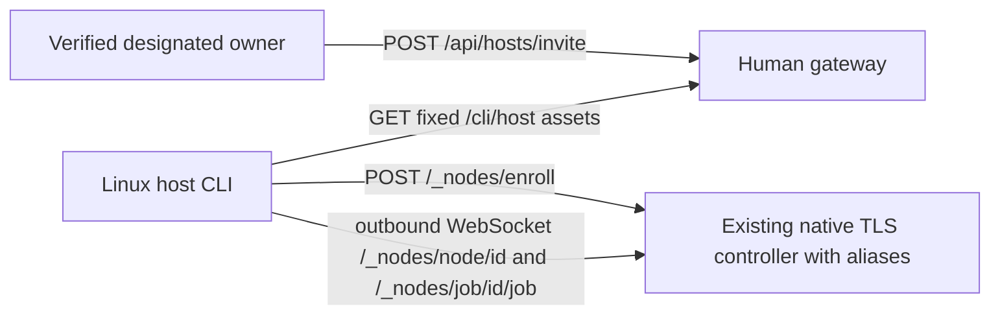

# host-core interface — implementation contract
State: final2 product frozen; bounded core managed slice passed; independent acceptance/public release pending. Pattern: ADR 0002 Rust gateway + SQLite ownership + outbound node protocol. Owner already authorized.

Title: invitation flow. Existing gateway/runtime reused; node namespace and guided CLI added. Human and node authority stay separate.

## Exact contracts
- Optional gateway `node_owner_subject` + `node_owner_user_id` bind administration to verified team issuer, subject and existing catalog user ID; email alone never grants administration. Unconfigured means denied. No embedded controller or second map. The existing native TLS controller alone owns the root lock, sessions, jobs, generations, proxies and connection limits. Its same router adds the public aliases. Existing native listener `/enroll`, `/node/{node}`, `/job/{node}/{id}` is preserved.
- Human POST `/api/hosts/invite`: JSON `{node,ttl,memory,slots,cpus}`; response `{ok:true,result:{node,secret,policy,expires,controller,memory,slots,cpus}}`. POST `/api/hosts/revoke`: `{node}`. Require existing JWT, same Origin, `x-ow-request: dashboard`, JSON; no default human node administration. Invitation response is private/no-store. UI owner controls and remote `ow host invite NODE --output PRIVATE_FILE` use these routes.
- Node namespace: only POST `/_nodes/enroll`, GET upgrade `/_nodes/node/{node}`, GET upgrade `/_nodes/job/{node}/{id}`. No query, encoded path, traversal or arbitrary proxy. Browser JWT never authorizes node calls. Enrollment secret in bounded JSON only; bearer node authority on WebSocket headers only. TLS/redirect/bounds and generation/revocation fencing inherited.
- Agent accepts an HTTPS origin optionally ending in exactly `/_nodes`; native origin remains supported. No userinfo/query/fragment/other path. This is intentionally a bounded base path.
- Default `ow host join`: hidden invitation JSON paste (echo restored by RAII on all ordinary exits; Ctrl-C cancels with echo restored), controller extracted/validated from envelope, shared-pool disclosure and explicit consent, capability diagnostics and bounded RAM/CPU/slot/minimum-free-space prompts. No human login or allowlist required. Saved remote login and OW_SERVER do not redirect participation commands. Advanced `ow host doctor`, `join --controller https://DOMAIN/_nodes --invite-file PRIVATE_FILE --memory 512 --slots 2 --cpus 2 --storage-gib N --accept-shared-pool`, `start`, `status`, `stop`. Global `--data-dir` explicitly selects a short private host root; default guided host root is a short user-owned directory. Invite file 0600/private parent, never argv secret or URL. Join downloads verified fixed assets and saves private budgets/config/credential; start runs worker and outbound agent, stop closes agent then stops this worker (guests stop, disks retained). No privileged repair/repartitioning.
- Public runtime manifest `/cli/host-manifest.json` and fixed blobs under `/cli/host/`: `firecracker`, `vmlinux`, `base.ext4`, `ow-guest`, `slirp4netns`, No network-tools archive in the Alpine-only host bundle: Alpine uses its own tools; the runtime extracts that helper only for Arch/Ubuntu, which this bundle does not prepare or advertise. Size/SHA256 and destination mapping validated; direct files, no archive extraction. Publisher only accepts allowlisted regular non-symlink sources and stages a dedicated immutable bundle. HTTPS manifest is the trust root, not a signature/attestation claim.
- Persistent config/root/credentials mode 0600/0700. Startup subprocess environment is cleared, fixed system PATH and exact private assets/budgets supplied; inherited OW runtime overrides cannot relax budgets. Config records shared-pool consent. Static budgets are disjoint operator commitments, not inferred host grouping.

## Verification gates
Prepare focused unit/HTTP/mock fixtures, dedicated target directory, no guest starts. Existing Ubuntu is 2048MiB/2vCPU; preserve it. Test allowance <=3 guests/768MiB, each new worker512/2/2, total host ceiling4 guests/3072MiB including Ubuntu, measured headroom required. Planner grants exclusive VM turn and coordinates reviewer/verifier. No cloud changes, service replacement or push. Physical/NAT evidence remains pending.

## Native takeover/rollout contract (supersedes embedded proposal)
1. Back up exact gateway config/catalog/binaries, controller command and dedicated tunnel/Access state privately. Verify a/b node IDs, credential files, native TLS endpoint/CA and placements before mutation. Never invoke wholesale `data/nl/manage.py stop` or rollback.
2. Replace/restart only the existing project controller binary with its original root/listen 127.0.0.1:8790/cert/key. The one router exposes both native and prefixed routes with one session map. a/b reconnect unchanged; gateway can restart separately with the explicit owner binding. Workers/Ubuntu keep running.
3. Dedicated Access app DOMAIN/_nodes/* plus exact ordered tunnel regex `^/_nodes/(enroll|node/[A-Za-z0-9_-]+|job/[A-Za-z0-9_-]+/[A-Za-z0-9_-]+)$` targets the fixed existing native HTTPS listener. Origin TLS uses its existing private CA file and matching server name, never noTLSVerify. Controller still checks credentials/methods/query/path and bounded protocol. Foreign ownership, collisions or shadowing fail closed before apply. Human routes/CLI retain their separate exact gates.
4. Rollback removes only owned node ingress/application changes, preserving unrelated later entries, restores old gateway/controller binary/config with scoped channel restart; a/b endpoint/credentials stay unchanged and worker/Ubuntu remain live. Schema additions are backward compatible auxiliary node_limits table; no routine catalog restore required. New public participants stop reconnecting after rollback, their registered demand remains conservative.

CPU caps persist in node_limits and clamp heartbeats server-side alongside RAM/slots. Legacy nodes without a cap keep existing protocol ceiling16, with their unchanged honest worker budgets2 governing effective CPU capacity. Re-mint invalidates all older unused secrets for the ID. Consent accepts only the exact supported policy and invitation bounds; server's persisted limits override tampered envelopes.
`--storage-gib` means minimum free GiB retained, not a quota/reservation. Join/start check free space; runtime admission preserves this threshold for create/capture. Actual disk quotas remain deferred. Prompt wording states this explicitly.

## Current lifecycle/trust/freeze contract

Advanced `host join --ca-cert PRIVATE_CA` validates and saves owned private CA
bytes as `controller-ca.pem`; assets, enrollment and future detached agent use
that saved trust, with no arbitrary inherited SSL environment. Default public
join uses system trust. Atomic pending config/credential/marker phases and exact
owned staging-remnant recovery support retry; lost redemption response still
requires owner revoke/fresh ID and preserved old root. Dispatchable requires a
fresh matching acknowledgement, agent instance/generation/node, held private
lock, live PID/start/executable and matching worker.

Unreadable same-UID cwd remains UNKNOWN unless independently bound to systemd
user-manager/PAM init.scope or root-supervised Tailscale SSH logind session leader
with exact PID/parent/launch/cgroup/UID. No generic same-UID ignore. Tools are
fixed, root-owned, environment-cleared, time/output-bounded and read-only.
See evolving `host-core-report.md` for superseded receipts and actual execution;
no product source/artifact claim implies live public deployment or physical NAT.
