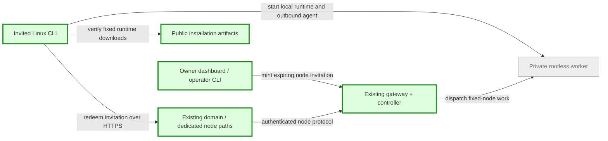

# Invited Linux hosts through one domain — plan brief
Size: L | Updated: 2026-10-03 | State: bounded release deployed; physical second-host test pending
Pattern: Rust gateway + SQLite ownership + outbound authenticated node agents; ADR 0002. Existing fixed public CLI artifacts and dedicated path-specific Access applications are the deployment pattern.

## Goal
An owner can invite a trusted Linux computer into this controller's explicitly shared private pool; its operator can install the CLI, run a guided host join and see the node online through the existing domain without Tailscale/router changes.

## What changes

Title: invited-host onboarding. Key: grey existing; green new/changed. Human Access identity and node credentials remain separate.

## Steps
1. Builder specifies executable CLI/invitation and fixed download contracts; reviewer audits authority, paths and recovery before public release.
2. Build owner-only invitations/revocation, host doctor/join/status/start/stop, guided RAM/CPU/storage limits, verified minimal Alpine assets and exact same-domain node routing.
3. Independent local CLI/browser/real-VM acceptance; planner merges only scoped reviewed commit and deploys dedicated paths/artifacts with backups.
4. Give the owner exact commands for the second physical Linux host; record NAT/placement/terminal/persistence/disconnect evidence when the owner runs them.

## Blast radius
Project gateway/controller/installer and a dedicated node-path Access application/tunnel entry on the existing project hostname. Preserve Ubuntu dev disk/checkpoint, current identities, unrelated services and pending files. Existing node credentials/routes remain compatible. No automatic repartitioning, global firewall/sysctl edits or broad auth exceptions.

## Done when
Owner-only invite mint/revoke, expiring atomic one-use enrollment, participant budgets and verified downloads pass denial/retry tests; a clean user install joins through actual project HTTPS/WebSockets, boots a real guest and preserves its disk. Human dashboard/API/PTY remain protected. Physical second-host/NAT evidence stays pending until actual remote execution. Installer emits actionable KVM/Btrfs/namespace/tool errors without unsafe repairs. Operator commands and rollback are recorded.

## Stop gates
- Authorization: no paid resources, marketplace, outreach, unrelated services, pushes or remote-machine writes without host access. User will distribute invitations.
- Host changes: unsupported storage/KVM requires a clear diagnostic; never format/repartition, grant privileged services or silently weaken confinement.
- Deployment: reviewer clears stable source + independent focused evidence before planner releases project-only same-domain changes. Fail closed if existing Access/tunnel ownership differs.
- Participation: this is an owner-managed trusted shared pool, not per-user private nodes. Only verified designated controller owner administers it; invitation must show the shared-pool policy and host operator retains stop control. No fabricated multi-tenant host isolation claim.

Current machines: only Ubuntu dev and latest checkpoint retained after owner cleanup; Ubuntu dev is running (2048 MiB/2 vCPUs) and must stay running. New test roots only; aggregate test peak at most 3 guests/768 MiB in addition to existing demand, total host ceiling 4 guests/3072 MiB, static new worker caps total 1024 MiB, preserve host reserve. Never use wholesale live manager stop/rollback; scoped gateway/controller/agent restart only. Builds use installed 1.97.0 toolchain and dedicated targets. Physical host details requested separately; no external-host access exists yet.
