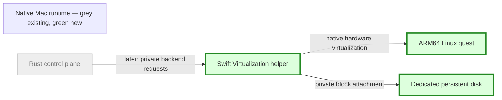

# Native Mac host — implementation brief
Size: L | State: authorized, implementation underway
Pattern: existing Rust control plane with explicit backend capabilities; narrow native helper around an existing virtualization engine.
Baseline: b1703f1b443c8380273eee3f9823e304170c95e5, isolated work/mac-host branch.

## Goal
Verify native ARM64 Linux workspaces on the owner's Mac, then connect a truthful backend to the existing private pool.

## Runtime slice

## Steps
1. Inventory host, pin clean ARM64 boot inputs, implement signed native helper and capability diagnostics.
2. Verify boot, shell/exec status, file round trip, cold persistence and owned process cleanup with one small guest.
3. Test native save/restore availability and disk independence; deny anything unsupported.
4. Extend Rust backend and node capability contracts in coordination with planner; STOP on conflicting wire contracts or before enrollment without a private invitation.
5. Evaluate Tahoe separately; STOP before new license acceptance, paid resources or downloads/guest allocations above initial budget.

## Blast radius
Isolated source worktree and ignored test root. No existing services or guest data touched. Initial test uses one guest, one vCPU, 512 MiB, <=20 GiB total storage, no network or shared folders. Maximum authorized local ceiling remains one guest, two vCPU, 2 GiB.

## Done when
Real hardware acceptance in mac-host-agent-handoff.md passes, with local and remote evidence separately recorded. A compile alone is not success. First checkpoint requires real uname -m, actual command status, binary file/persistent disk verification across cold boot, capability denials and confirmed helper exit.

## Stop gates
Private invitation for controller acceptance; shared wire conflict; allocation above handoff budget; Tahoe licensing/payment; deployment, push and main merge. Block dependent work only. No repeated implementation approval: handoff and owner's start/continue authorize this lane.
