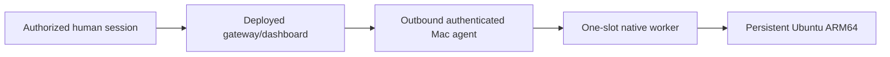

# Mac live pool acceptance — brief
Size: M | Pattern: ADR0002 outbound authenticated nodes + ADR0004 native bounded Mac backend.
User explicitly authorized this acceptance; no additional implementation/deployment go required.

## Goal
Enroll the dedicated Mac pilot and prove persistent Ubuntu ARM64 through the deployed human gateway/dashboard.

## Steps
1. Update main and pin native build/assets; secure privately delivered invitation.
2. Enroll fresh pilot root at 1024 MiB / 2 CPUs / one slot; require dispatchable acknowledgement.
3. Human gateway/dashboard tests: create, exec/files/PTY, cold persistence and node reconnect.
4. Denials and sanitized report; retain node/fixtures and describe unavailable checks.

## Boundaries / stops
No Linux service or cloud changes, no code push/deployment. Preserve all fixtures/services.
One concurrent real guest and <=20 GiB dedicated physical storage. Pause only dependent
steps for missing/expired invite, human login, resource headroom or coordinated revoke/cross-owner identity.

## Done when
Observed dispatchable state and real gateway product checks are recorded separately from
prior isolated TLS evidence, with exact source/build/asset hashes and remaining gates.
