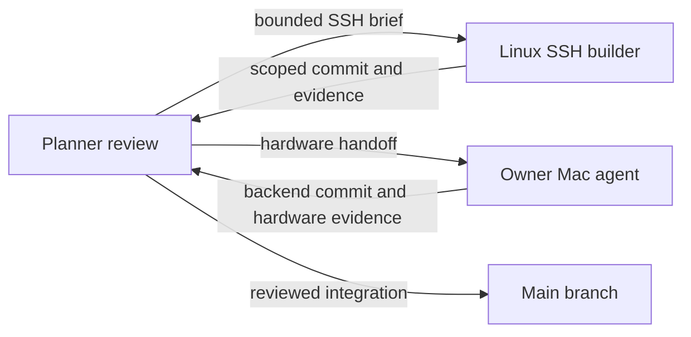

# Mac hosting and guest SSH — coordination
Updated: 2026-10-04 | Size: L | State: Mac handoff ready; Linux SSH source reviewed/merged, deployment pending
Pattern: existing authenticated gateway, SQLite ownership/fixed placement, outbound nodes; backend capabilities are explicit.

Owner requested a Mac-agent implementation/testing handoff and dispatch of a separate SSH builder. Mac hardware work stays on the Mac; Linux SSH work uses an isolated lane. Read [Mac handoff](mac-host-agent-handoff.md) and [SSH brief](ssh-guest-brief.md). Shared wire/schema changes must be coordinated by planner before merge. Owner subsequently authorized source push for Mac handoff; main b1703f1 was pushed. Guest SSH source a38a635 integrated as f1ab6ad after source/evidence review; portable/live deployment remains pending. See ssh-guest-planner-handoff.md.

All boxes are task roles; arrows are deliverables. Main merge/publication follows evidence; no automatic deployment of experimental Mac or SSH source.

Stop gates: conflicting wire/ownership contracts; new paid/license acceptance; host budgets; existing guest/service changes; deployment before stable acceptance. Existing authorization covers writing docs and starting the SSH builder, so no repeated go. Keep pending management files outside scoped commits.
