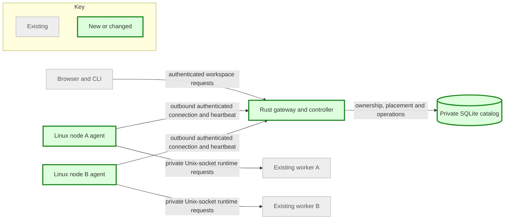
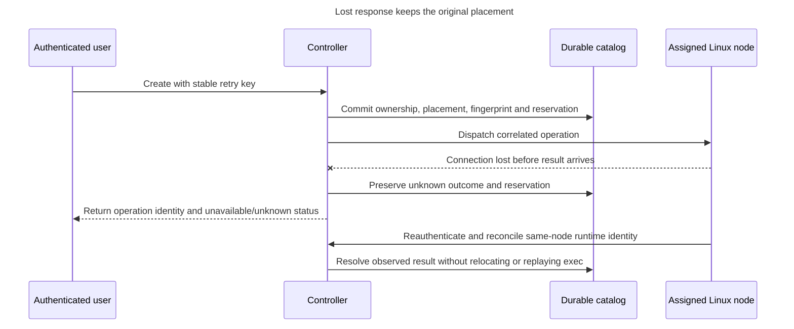

# Multi-node Linux vertical slice — plan brief
Size: L | State: authorized by owner, 2026-10-03
Pattern: extend the existing Rust gateway + SQLite ownership catalog + private Unix-socket worker; reuse Firecracker/Btrfs under ADR 0001.

## Goal
Operate a private pool through one controller, with outbound authenticated Linux workers, durable placement and safe offline/reconnect behavior.

## Architecture

## Failure contract

Key: solid arrows are requests/state updates; the crossed arrow is a lost result. This is the required behavior, pending implementation and acceptance evidence.

## Steps
1. Review transport/enrollment threats and define an ADR with explicit compatibility limits.
2. Implement node identity/enrollment, bounded outbound transport, heartbeat and revocation.
3. Route ownership-checked operations and terminals by durable placement; reject offline nodes and preserve uncertain outcomes.
4. Independently review security and exercise two isolated workers, real guests, retries and controller/node restart.
5. Merge reviewed code, build release and deploy the project locally with rollback; record evidence and remaining physical-host checks.

## Blast radius
This repository and dedicated project data/processes only. Preserve existing workspaces, desktop, unrelated services, global firewall and shared ingress. No paid resources, outreach, marketplace, Mac runtime, cross-node snapshots or automatic migration. Existing public project ingress can be reused only if the new node channel has its own suitable authentication boundary; no credential/identifier publication.

## Done when
Two isolated Linux workers enroll outbound; create on selected/automatic compatible node, exec and transfer data, cold restart preserves disk, ownership/credential/revocation denials pass, offline placement is rejected, reconnect/retry cannot create duplicate guests, terminal routing works, and legacy single-host tests pass. Record same-host validation separately from second-physical-host/NAT acceptance. Node resource limits must preserve host headroom across both workers.

## Named stop gates
- **External resources:** new remote host access, paid resources, DNS/Access policy beyond existing scope or unrelated service changes require owner scope.
- **Host privilege:** stop on required global privilege/security changes; prepare a bounded alternative first.
- **Data safety:** migration must preserve existing catalog/runtime data; stop if destructive conversion or unrecoverable data loss is required.
- **Deployment review:** deploy locally only after reviewed diffs and passing relevant checks; rollback on failure. Physical cross-network acceptance needs an actual second authorized host.

## Worker lanes
- node-core: bounded Rust implementation in an isolated worktree; commits restricted to task code/tests/docs.
- node-review: architecture/threat review and later independent implementation review; no product code.
- node-verify: independent real-worker/VM acceptance and local deployment after implementation review.
