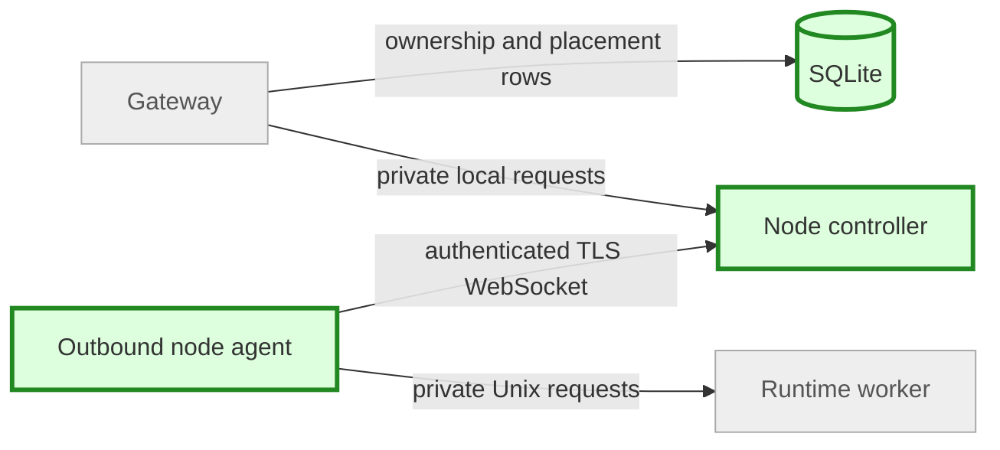

# Multi-node implementation — plan brief
Size: L | State: authorized | Pattern: Rust gateway / SQLite ownership / private Unix worker

## Goal
Two outbound Linux agents provide authenticated, fixed-placement workspace control and terminals, preserving single-host operation.

## Node channel (new green, existing grey)

## Steps
1. Add enrollment, scoped credentials, bounded outbound channels and offline/revocation handling.
2. Migrate catalog non-destructively; add durable placement and safe operation retries.
3. Add CLI/dashboard placement and same-node snapshot/terminal routing.
4. Validate locked tests and isolated two-worker guests; record evidence, commit and hand off for independent review.

## Blast radius and stop gates
Dedicated test roots/processes only. Stop before destructive migration, privileged global host changes, paid/external resources, or required unavailable remote-host access. No publishing or deployment to existing services. Planner owns merge/deployment.

## Done when
Enrollment/replay/expiry/credential/revocation/ownership/placement/offline/duplicate tests pass, real same-host guests demonstrate exec/files/persistence/fork/terminal, and commands and remaining physical-host limits are documented.
