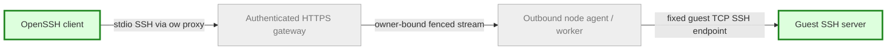

# Actual guest SSH — builder brief
Updated: 2026-10-04 | Size: L | State: authorized, ready to dispatch
Pattern: ADR0002 authenticated gateway + fixed SQLite ownership/placement + fenced outbound node jobs; existing rootless guest network policy.

## Goal
A logged-in owner can use a real OpenSSH client to reach their Linux guest locally or on an outbound remote node, with an easy `ow ssh MACHINE` entry point and an explicit standard OpenSSH ProxyCommand/config path for editor workflows. This must be SSH protocol to a guest SSH server, not a PTY relabeled SSH.

## Data flow / changes

Grey: existing authority/transport. Green: new SSH entry and guest server. Guest SSH must not require a public listener or inbound node port.

## Read first / scope
Read root AGENTS.md, README.md, docs/HANDOFF.md, ARCHITECTURE, ADR0001/0002, NETWORKING, USERS, TERMINALS, HOSTS and current multinode/compressed reports. Product changes in isolated work/ssh-guest lane. Allowed: CLI/remote/gateway/catalog/node/worker narrow SSH transport, guest provisioning/image scripts, focused harnesses/docs and justified pinned dependencies. Do not refactor the runtime broadly. Mac implementation is a separate lane; agree new wire/capability contracts through planner.

## Steps
1. Inspect current TCP/network/guest-agent and node bridge APIs. Write short design/contracts before coding, including guest-server provisioning, key enrollment/revocation and host-key trust across capture/fork/restore. Use ordinary OpenSSH client/server where suitable; no custom cryptography. Explain any alternative server/license.
2. Implement bounded binary stdio proxy and owner-authorized fixed machine SSH endpoint using verified TLS/no redirects and existing generation fencing. No arbitrary destination/port, peer guest, host metadata, worker sockets or general tunnel endpoint. Authorize before physical lookup, guest mutation or connection. Frame/connection/idle/deadline bounds and disconnect cleanup required. Treat node replacement/revocation as stream invalidation.
3. Implement `ow ssh MACHINE` and a documented config/ProxyCommand output usable by standard `ssh`/SFTP/editor. Keep diagnostics on stderr and raw SSH bytes on stdout. Preserve OpenSSH end-to-end server verification; do not set StrictHostKeyChecking=no or auto-trust changed keys. Use explicit owner-scoped key registration/guest authorization, never upload user private keys. Do not alter ~/.ssh/config or unrelated keys without requested opt-in; supply reviewable generated config.
4. Provision new Ubuntu/Arch guest profiles with guest-only sshd and secure key auth. Existing guests require explicit opt-in upgrade, not automatic disk mutation. Disable passwords/root login by default; use dev user where available. Ensure clone-specific host identities and key material; snapshot restore behavior and trust conflicts must be explicit. Retain prior assets and versioned manifests; avoid silently invalidating frozen bundle pins. Do not rebuild/publish live assets yourself.
5. Focused verification and scoped commit/report/handoff; planner reviews before deployment. Real guest SSH exec/PTY/exit codes/SFTP, denied foreign owner before worker contact, malformed targets/unknown offline, TLS wrong CA/hostname, active revoke/replacement bidirectional stale bytes, key denial/revocation and host-key persistence/clone separation, bounded resources, cold restart and stopped-guest behavior. Test stdio never emits logs. Document forwarding support/denials; guest forwards must obey guest network isolation.

## Budget / coordination
No live controller/gateway/tunnel/agent/worker restart and no existing owner guest/disk/snapshot mutation. Initially run offline/unit tests. For real VM acceptance send planner exact method/resource/cleanup plan; use dedicated roots, max ONE new guest at a time <=1GiB/2vCPU and disjoint worker cap, minimum host reserve; planner grants exclusive host turn after reading it. Existing Ubuntu remains running. Private test TLS/ownership fixtures allowed, never disable production auth. No remote SSH into owner hosts without explicit access.

## Named stop gates
AUTHORITY: design needs broad host TCP/public port or weakened ownership/TLS/fencing. IDENTITY: cannot prove fork/restore-safe host-key behavior. RESOURCES: budgets/new paid dependencies exceeded or unrelated service affected. RELEASE: source/evidence stable; stop before publication, shared service writes, push or merge. Continue independent work if one gate blocks.

## Return / done
Scoped source commit, docs/plans/ssh-guest-report.md, ssh-guest-handoff.md and docs/SSH.md with exact user commands; real commands/results/logs/hash attribution and limits. Work is done when actual SSH and files work through local and node routing, denial/fencing/identity cases pass, and cleanup is proven. A mock stream or passing PTY test alone is insufficient. No production or Mac claims without respective evidence.

Primary reference: https://www.openssh.org/manual.html (OpenSSH client/config/server/key lifecycle manuals). Use official sources for new protocol/API decisions.
